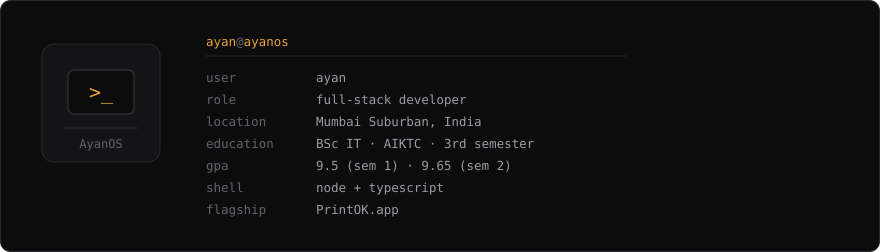
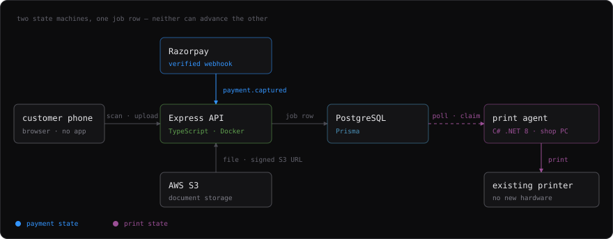
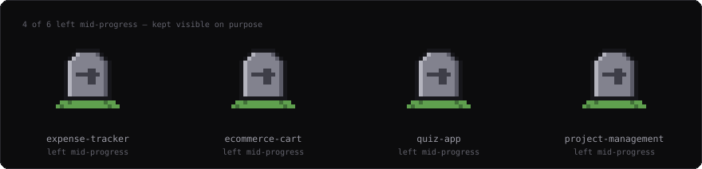

I build backends that have to be right about money. Most of what I know came out
of one project.



---

## `PrintOK.app`

[](https://print-ok-customer-web.vercel.app)
[](https://github.com/Ayan-css/PrintOK)


**Hardware-free print-on-demand.** A customer walks into a print shop, scans a QR
code, uploads their file and pays from their own phone. A background agent on the
shop's existing Windows PC picks the job up and prints it. No new hardware, no
counter queue, no USB stick.

```
QR scan → upload (signed S3 URL) → quote (rate card frozen) → pay → queued → agent prints
```



**Payment state and print state never touch.** A paid job and a printed job are
different facts. Collapse them into one status field and a webhook replay or a
printer jam charges someone twice. Two more decisions in the same spirit:

- **Prices are integer paise.** `₹12.40` is stored as `1240`. A per-page rate times
  a page count in floating point drifts, and a drifting total is an argument with
  a customer standing at the counter.
- **The rate card is frozen at quote time.** Shops change rates. Snapshot the card
  onto the job when it's quoted, and the price you were shown is the price you pay.

<details>
<summary><b>What exists, rather than what's claimed</b></summary>

<br>

```
43 automated tests    incl. a Postgres integration suite, against a real DB
REST API              Express · TypeScript · Prisma/PostgreSQL
                      job lifecycle, agent pairing, credential revocation,
                      admin console
C# .NET 8 agent       self-contained, ships to GitHub Releases via Actions
CI/CD                 GitHub Actions on push to main
deployment            Render (API) · Vercel (web) · Supabase (db/storage)
```

Pre-launch. Built, deployed and validated end to end — not yet running in a real
shop, so there are no customers to claim.

</details>

---

## `~/stack`

<sub>Grouped the way they are on my resume. No proficiency bars — a number would
only be a guess wearing a percentage sign.</sub>

**Languages**


**Frontend**


**Backend**


**Databases**


**Cloud & DevOps**


**Tools**


---

## `~/projects/Porejects`



Six standalone JavaScript/HTML/CSS apps built to practise DOM manipulation, state
handling and API integration — all in one repo. Four of them I started and
stopped, and they're still on the shelf on purpose: a portfolio that only shows
finished things is telling you half of what happened.

<details>
<summary><b>The full folder</b></summary>

<br>

```
Porejects/
├── expense-tracker        †  left mid-progress
├── ecommerce-cart         †  left mid-progress
├── todo-app
├── weather-app
├── quiz-app               †  left mid-progress
└── project-management     †  left mid-progress
```

None of these is PrintOK-scale, and pretending otherwise would flatten the one
project that is.

**[github.com/Ayan-css/Porejects](https://github.com/Ayan-css/Porejects)**

</details>

---

## `timeline.log`

```
[edu]   Apr 2025 — present   BSc Information Technology
                             Anjuman-I-Islam Kalsekar Technical Campus, New Panvel
                             3rd semester · SGPA 9.5 / 9.65

[lead]                       President — Rise Club

[teach]                      Co-Instructor & Host — Git & GitHub Hands-On Workshop
                             led a live session on version control fundamentals

[lead]                       Media Team — Igniters Club, AIKTC (via Unstop)

[cert]                       Google Developer Student Jam — Google Developer Groups
```

---

## `~/contact`

```
$ curl github.com/Ayan-css
$ curl linkedin.com/in/ayan-ansari-053849313
$ mail ayan48311@gmail.com
```

[](https://github.com/Ayan-css)
[](https://www.linkedin.com/in/ayan-ansari-053849313/)
[](mailto:ayan48311@gmail.com)

<!--
  Once AyanOS is deployed, add the portfolio link here:
  [](https://YOUR-URL-HERE)
  Left commented out on purpose — a dead link on a profile is worse than no link.
-->

```
$ uptime
up since Apr 2025 · 1 flagship, 6 practice apps, 0 fake metrics
load average: caffeinated
```
